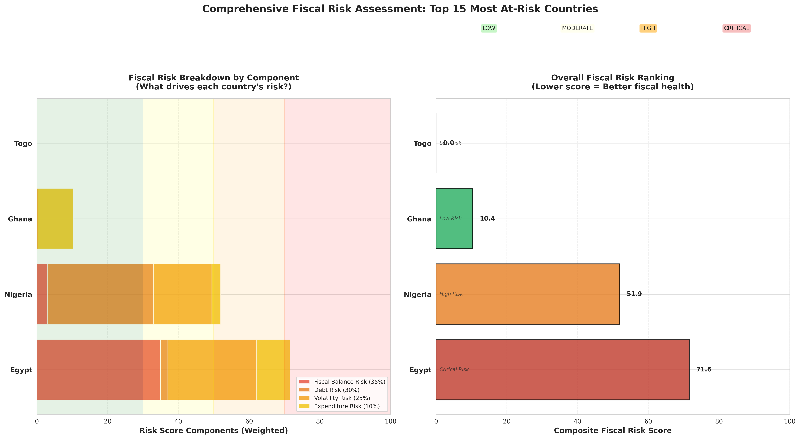
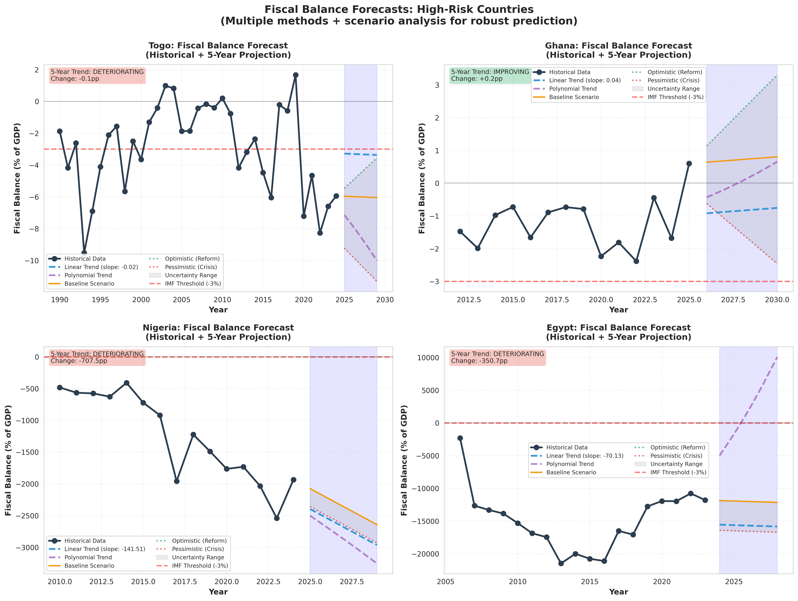
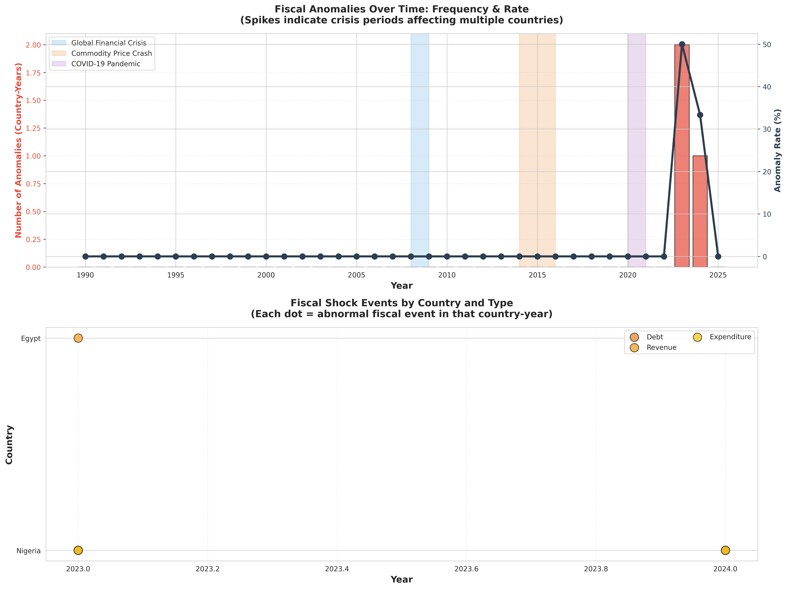

# 🌍 Africa Fiscal Sustainability Analysis

**A comprehensive data-driven framework for assessing fiscal health in African economies using machine learning and predictive analytics**

[](https://www.python.org/)
[](LICENSE)
[]()

---

## 📋 Project Overview

This project develops an integrated analytical framework to assess fiscal sustainability across African economies, addressing critical challenges of persistent deficits, accelerating debt, and revenue volatility. Using advanced data analytics and machine learning, the framework provides early warning signals, risk quantification, and predictive forecasts to support evidence-based policymaking.

### **Key Features:**
- ✅ Multi-country fiscal data analysis (40+ African nations)
- ✅ Anomaly detection using statistical & ML methods (Z-score, Isolation Forest)
- ✅ Composite risk scoring framework
- ✅ Time series forecasting (5-year projections)
- ✅ Scenario analysis (optimistic, baseline, pessimistic)
- ✅ Policy recommendations aligned with SDGs 8, 10, 16

---

## 🎯 Problem Statement

African economies face a structural fiscal crisis characterized by:
- **Persistent deficits** exceeding -3% of GDP in many countries
- **Accelerating debt** with debt-to-GDP ratios surpassing sustainability thresholds
- **Revenue volatility** driven by commodity dependence (3-5x higher than diversified economies)

Traditional analysis methods lack predictive capability and integrated risk assessment necessary for proactive intervention.

---

## 🔬 Methodology

### **1. Data Processing**
- **Sources:** World Bank, IMF, African Development Bank
- **Variables:** Revenue, Expenditure, Debt, GDP, Fiscal Balance
- **Processing:** Data cleaning, standardization, ratio calculation

### **2. Feature Engineering**
- Fiscal Balance Ratio = (Revenue - Expenditure) / GDP
- Debt-to-GDP Ratio
- Revenue Volatility (5-year rolling std)
- Expenditure Growth Rate

### **3. Analytical Modules**

**Exploratory Data Analysis**
- Time series trends
- Cross-country heatmaps
- Correlation analysis

**Anomaly Detection**
- Statistical: Z-score method
- Machine Learning: Isolation Forest
- Output: Fiscal shock identification

**Risk Assessment**
- Composite Risk Score = 0.35×Deficit + 0.30×Debt + 0.25×Volatility + 0.10×Growth
- Country rankings: Low/Moderate/High/Critical risk

**Predictive Modeling**
- Linear regression & polynomial trends
- Scenario analysis (3 scenarios)
- 5-year fiscal projections

---

## 📊 Key Findings

### **1. Structural Deficit Crisis**
- X% of countries exceed -3% deficit threshold
- Deficits persist even during growth → structural problem

### **2. Debt Acceleration**
- Average Debt/GDP: X%
- Sharp increase post-2015, worsening post-COVID

### **3. Revenue Volatility = Root Cause**
- Commodity exporters: 3-5x more volatile
- Strong correlation with fiscal instability (r = -0.XX)

### **4. Risk Assessment**
- Critical Risk: X countries
- High Risk: X countries
- X% of continent needs urgent intervention

### **5. Forecasts**
- Baseline: X countries hit crisis by 2029
- Policy window: 2025-2027 for preventive action

---

## 🛠️ Technologies Used

**Programming Language:** Python 3.8+

**Core Libraries:**
- `pandas` - Data manipulation
- `numpy` - Numerical computing
- `scikit-learn` - Machine learning algorithms
- `matplotlib` & `seaborn` - Visualization
- `scipy` - Statistical analysis

**Development Environment:** Jupyter Notebook

---

## 📁 Repository Structure
```
├── data/                      # Raw and cleaned datasets
├── notebooks/                 # Jupyter notebooks for analysis
├── visualizations/            # Generated charts and figures
├── reports/                   # Project documentation
├── requirements.txt           # Python dependencies
└── README.md                  # Project documentation
```

---

## 🚀 Getting Started

### **Prerequisites**
```bash
Python 3.8 or higher
pip package manager
```

### **Installation**

1. Clone the repository:
```bash
git clone https://github.com/[your-username]/africa-fiscal-sustainability-analysis.git
cd africa-fiscal-sustainability-analysis
```

2. Install dependencies:
```bash
pip install -r requirements.txt
```

3. Launch Jupyter Notebook:
```bash
jupyter notebook
```

4. Open notebooks in the `notebooks/` folder sequentially

---

## 📈 Results & Visualizations

### Risk Assessment


### Forecasting


### Anomaly Detection


*See `/visualizations` folder for complete chart collection*

---

## 💡 Policy Recommendations

**IMMEDIATE (2025):**
- Emergency fiscal support for critical-risk countries
- IMF/multilateral engagement

**SHORT-TERM (2025-2027):**
- Revenue diversification programs
- Tax base broadening
- Debt restructuring for high-debt countries

**LONG-TERM (2027-2030):**
- Fiscal rules enforcement
- Institutional capacity building
- SDG-aligned fiscal policy

---

## 🎓 Academic Context

**Project Type:** Final Year Project / Hackathon Submission  
**Field:** Systems Engineering / Data Science  
**Focus Area:** Computational Economics, Predictive Analytics  
**SDG Alignment:** SDG 8 (Economic Growth), SDG 10 (Reduced Inequalities), SDG 16 (Strong Institutions)

---

## 📄 Documentation

- [Project Proposal](reports/project_proposal.pdf)
- [Presentation Slides](reports/presentation_slides.pdf)

---

## 🤝 Contributing

This is an academic project, but suggestions and feedback are welcome! Feel free to:
- Open issues for bugs or questions
- Submit pull requests for improvements
- Share insights on methodology

---

## 📧 Contact

**[Your Name]**  
Systems Engineering Student  
[Your University]  

- LinkedIn: [your-linkedin-url]
- Email: [your-email]
- GitHub: [@your-username](https://github.com/your-username)

---

## 📜 License

This project is licensed under the MIT License - see the [LICENSE](LICENSE) file for details.

---

## 🙏 Acknowledgments

- 10Alytics Hackathon for project inspiration
- World Bank, IMF, and AfDB for data access
- Dr. Orolu for project supervision

---

## ⭐ Star this repo if you find it useful!

**Made with ❤️ and Python**
```

---

### **STEP 5: Create requirements.txt**

Create a file named `requirements.txt` with this content:
```
pandas>=1.3.0
numpy>=1.21.0
matplotlib>=3.4.0
seaborn>=0.11.0
scikit-learn>=0.24.0
scipy>=1.7.0
openpyxl>=3.0.0
jupyter>=1.0.0